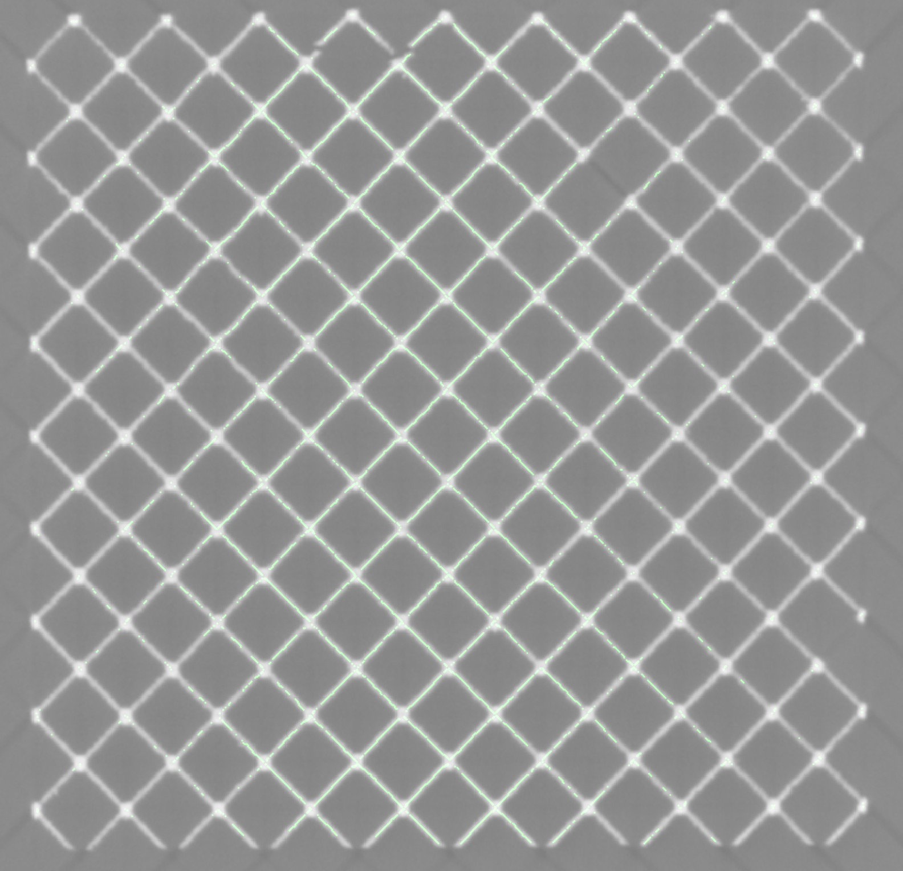
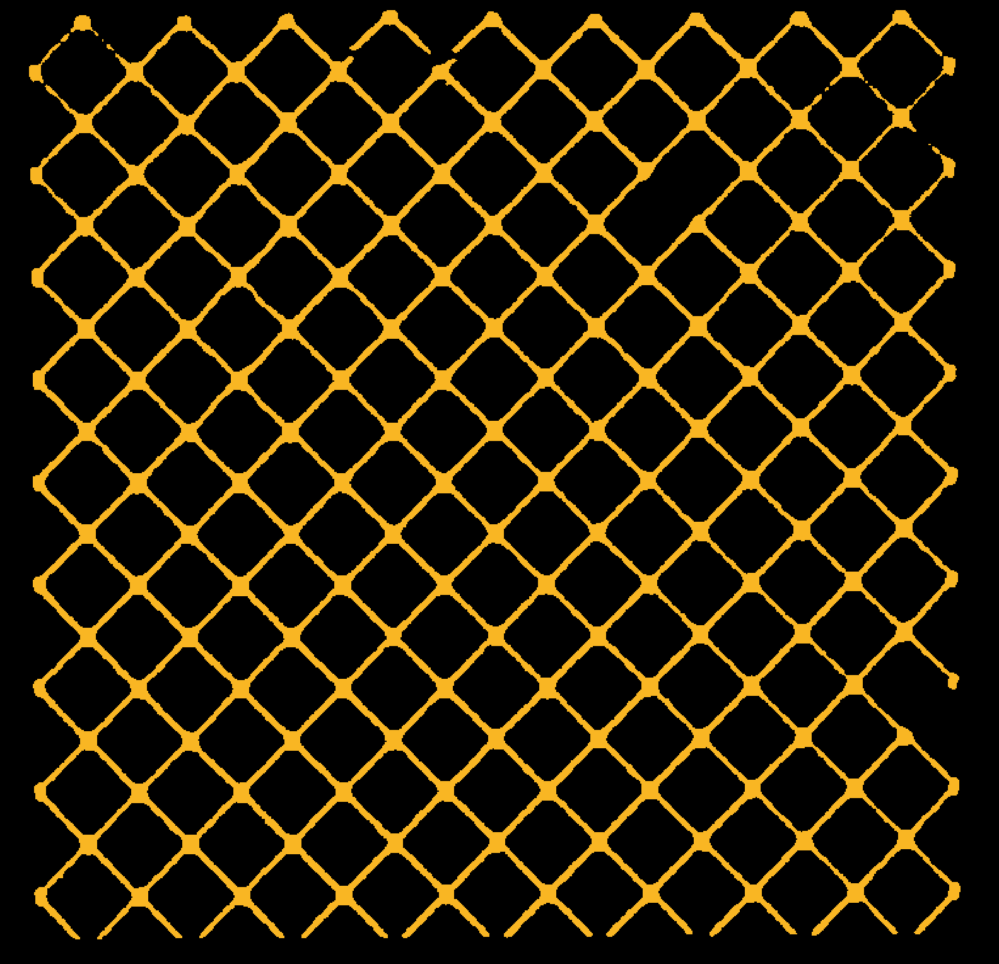
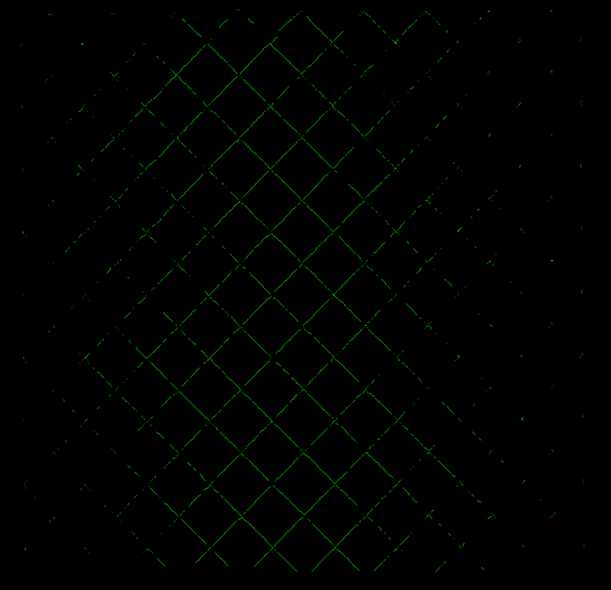

# 2026 Data Science Summer Institute (DSSI) Challenge: Agentic AI for Materials Science 

<small> LLNL-MI-2020827. This work was performed under the auspices of the U.S. Department of Energy by Lawrence Livermore National Laboratory under contract DE-AC52-07NA27344. Lawrence Livermore National Security, LLC </small>

Over the next few weeks, you will learn the basics of **Agentic AI** and apply these cutting-edge techniques to a research problem in materials science. We will utilize a coding agent to build the essential pieces needed for an effective multi-agent system for materials science. 

### Why Agentic AI for Materials Science?
The landscape of computational science is rapidly evolving. While traditional machine learning has excelled at isolated tasks, like predicting a material property or segmenting an image, **Agentic AI** represents the next paradigm shift. By equipping Large Language Models (LLMs) with tools, planning capabilities, and the ability to autonomously interact with datasets and software environments, we can build *autonomous AI research assistants*. These agents can execute multi-step scientific workflows, parse complex experimental data, identify anomalies, and even suggest iterative experimental designs. Understanding how to build and orchestrate these systems is quickly becoming a foundational skill for the next generation of researchers. 

## Background in Materials Science
We are working with [**X-ray CT scans of strut-based lattice structures**](https://www.sculpteo.com/en/3d-learning-hub/basics-of-3d-printing/what-are-lattice-structures/)  that were manufactured using laser powder bed fusion (LBPF). 

---

## Prerequisites
- **Codex CLI and/or Codex Application:** You may use the [Codex CLI](https://learn.chatgpt.com/docs/codex/cli#getting-started) locally, and/or use the [Codex application](https://chatgpt.com/codex/).
- **Important: Codex Usage is not Unlimited:** A a key rule, newer/larger frontier models typically cost more; reserve their highest-intelligence capabilities for tasks that genuinely need them, such as designing multi-step agent workflows, reviewing complex scientific assumptions. For routine coding, formatting, small bug fixes, documentation edits, and repeated test iterations, use earlier/lower-cost models or lower reasoning settings to conserve your credit. Coordinate with your team to utilize your API keys equally. 
- **Codex Documentation:** Detailed documentation on Codex development is available [here](https://developers.openai.com/codex). For CLI setup, see the [Codex CLI getting started guide](https://learn.chatgpt.com/docs/codex/cli#getting-started), or open the [Codex application](https://chatgpt.com/codex/).

## Part 1: Foundations of Agentic AI for Materials Science

In the first half of the challenge, we will gradually build an agentic workflow from scratch using the **Codex CLI** and/or the **Codex application** where appropriate. You will learn how to transition from traditional scripting to autonomous agent-driven materials science.

### Simulated Dataset with Defects
For this challenge, we will use the [X-ray CT Data of Additively Manufactured Octet Lattice Structures](https://data-science.llnl.gov/open-data-initiative) from DSI's Open Data Initiative. This dataset contains simulated X-ray CT data of additively manufactured lattice structures with common, manually inserted defects: bent, broken, missing, and thin struts, as well as dross defects. 

Each sample includes:
* **An input CAD model:** A triangle mesh (`.obj/.stl`) of the structure. 
* **A simulated CT scan:** A 3D Numpy array (`.npy`) where values correspond to X-ray CT density within [0, 1].

### Environment Setup

To run the codebase and participate in the challenge, we recommend using [Conda](https://docs.conda.io/en/latest/) to manage your environment.

1. **Create a new conda environment:**
   ```bash
   conda create -n dssi_env python=3.11 -y
   conda activate dssi_env
   ```

2. **Install the required dependencies:**
   ```bash
   pip install -r requirements.txt
   ```

### Coding Agents

A **coding agent** is an AI-powered assistant designed to help with software development and scientific workflows by interacting with your local environment. In this challenge, you can use the **Codex CLI** and/or the **Codex application**. Some local setup and MCP workflow steps below are specific to the Codex CLI.

### Exploring Model Context Protocol (MCP)

**Model Context Protocol (MCP)** is one of the most basic methods to enable LLMs to call tools. Historically, giving LLMs access to tools required writing custom "glue code" for every single tool and every single LLM integration. This was brittle, hard to maintain, and lacked security. MCP solves this by providing a **standardized, open protocol** that acts as a universal interface between LLMs and external data/tools.

For scientific workflows, MCP is particularly powerful because it allows us to:
1. **Decouple Logic from the LLM:** Your scientific scripts live in their own environment, and the LLM interacts with them through a clean API.
2. **Standardize Tool Discovery:** The LLM can automatically "discover" what tools are available without you needing to hardcode descriptions into every prompt.
3. **Enhance Security:** MCP provides a controlled layer where you can define exactly what the LLM can and cannot do on your system.

#### Basics of MCP
At its core, MCP follows a **client-server architecture**:
*   **MCP Server:** A small program (often a Python script) that "hosts" your tools. It tells the client what functions it has and how to call them.
*   **MCP Client:** The application the user interacts with (like the Codex CLI or this IDE). It connects to the server, asks for available tools, and sends execution requests.
*   **JSON-RPC:** The language they speak to each other. It's a lightweight way to send structured commands and data back and forth.

#### How MCP Tools Are Defined
In this challenge, the MCP server is implemented with [FastMCP tools](https://gofastmcp.com/servers/tools). FastMCP turns normal Python functions into tool definitions that an MCP client, such as Codex CLI, can discover and call. The important pieces are:

* **The `@mcp.tool()` decorator exposes the function.** A function is not available to Codex through MCP unless it is registered as a tool.
* **The function name becomes the tool name.** For example, `segment_ct_dataset` is the name the client sees unless you explicitly override it in the decorator.
* **The docstring becomes the tool description.** Write docstrings that tell the agent what the tool does, what each argument means, and what the return value represents.
* **Type annotations define the input schema.** Parameters such as `input_filepath: str`, `threshold: float`, and `axis: int = 0` are converted into the JSON schema the client uses when calling the tool.
* **Parameters without defaults are required; parameters with defaults are optional.** For example, `axis: int = 0` can be omitted by the agent, but `input_filepath` must be supplied.
* **Avoid `*args` and `**kwargs` in MCP tools.** FastMCP needs a complete, explicit function signature to generate the tool schema.
* **Return simple, useful outputs.** For these tasks, returning a short status string is enough, but MCP tools can also return structured data when a workflow needs machine-readable results.

Minimal FastMCP example:

```python
from fastmcp import FastMCP

mcp = FastMCP("CT Segmentation")

@mcp.tool()
def segment_ct_dataset(input_filepath: str, output_filepath: str, threshold: float) -> str:
    """Segment a 3D CT dataset with a density threshold and save the mask."""
    # Load data, create mask, save output...
    return f"Saved segmentation to {output_filepath}"

if __name__ == "__main__":
    mcp.run()
```

The server script in this repository, `src/mcp_server.py`, should follow this pattern as you add each tool.

#### Basic Image Processing Terms
Before starting Tasks 1-3, here are a few image-processing terms you will use with respect to a volume/image:

* **Segmenting** means separating the parts of the data you care about from the background. In this challenge, segmentation usually means turning CT density values into a binary mask where lattice material is marked as foreground and empty space is marked as background.
* **Slicing** means looking at one 2D cross-section from a 3D dataset. A CT scan is a stack of many image slices, so viewing one slice helps you inspect what the data or segmentation looks like at a specific position.
* **Skeletonizing** means reducing a segmented structure to a thin centerline representation while preserving its overall shape and connectivity. For lattice structures, this can make it easier to reason about struts, nodes, and defects.

The images below show the same 2D slice from the `9x9x9_octet_lattice` dataset at three stages of the workflow. First, the raw CT slice shows the grayscale density values. Next, segmentation converts those density values into a mask that separates lattice material from background. Finally, skeletonization extracts a thin centerline from the segmented lattice so the strut network and junction connectivity are easier to analyze.

| Raw CT slice | Segmentation mask | Extracted skeleton |
| --- | --- | --- |
|  |  |  |

### Task 1: Tool Calling with MCP

In the first task, you should create the following function as an MCP tool: 
```python
def segment_ct_dataset(input_filepath: str, output_filepath: str, threshold: float) -> str:
    pass # Implementation goes here
```

Add the MCP tools to your Codex CLI configuration file at `~/.codex/config.toml` and then test it in the Codex CLI. You should add the following block, making sure to use the absolute paths for your Python executable and the server script. Replace `<PATH_TO_PYTHON_EXE>` with the path to your Python executable and `<PATH_TO_DSSI_CHALLENGE>` with the path to your DSSI Challenge directory:

```toml
[mcp_servers.segmentation-tools]
command = "<PATH_TO_PYTHON_EXE>"
args = ["<PATH_TO_DSSI_CHALLENGE>/src/mcp_server.py"]
env = {}
```

You can test if the MCP tool is available in Codex by starting the Codex CLI from this repository and inspecting the configured MCP servers with the `/mcp` command. If you get an error, make sure you have the correct path to your MCP server script. This is adding the MCP server to your global Codex CLI configuration.

> [!IMPORTANT]
> After changing `~/.codex/config.toml`, close and restart the Codex CLI so the updated MCP server configuration takes effect.

Refer to the Codex configuration reference for more details: [Codex configuration](https://developers.openai.com/codex/config-reference)

To test your tool, ask Codex CLI to segment the dataset, for example: 
> "Please segment the dataset in `data/unitcell/unitcell.npy` with a threshold of ..."

### Task 2: Multiple MCP tools

Now that you have one tool, it's time to add a second! Your next task is to implement the `visualize_slice` function as another MCP tool:

```python
def visualize_slice(input_filepath: str, output_filepath: str, slice_index: int, axis: int = 0) -> str:
    pass # Implementation goes here
```

After implementing and adding the tool, test it again in the Codex CLI. You should now have two tools available. Try asking Codex to first segment a dataset and then visualize a slice of the output!

### Task 3: MCP as a Wrapper for APIs

In the previous tasks, you created custom functions specifically for the LLM to invoke. However, MCP tools were often utilized as wrappers to expose existing functions from a software's API. This enables the LLM to effectively "control" the software without needing to rewrite its core logic. 

To demonstrate this, create a third MCP tool that exposes the `skeletonize_mask` function from the provided `skeletonization.py` script to simulate an API wrapper:

```python
def skeletonize(input_filepath: str, output_filepath: str) -> str:
    pass # Implementation goes here, calling skeletonize_mask internally
```

You can now prompt the agent to segment the raw CT data, visualize, and then skeletonize it!

### Task 4: Skills - Report for Non-destructive Evaluation 

While MCP provides a powerful way to equip LLMs with tools, it does have limitations. Front-loading an LLM with a large number of MCP tools upfront can bloat the context window. Additionally, as the number of available tools grows, issues with tool selection can arise, making it harder for the LLM to reliably choose the right function for a given task. 

Skills can help mitigate these issues by providing focused, domain-specific instruction sets and tools designed for particular workflows. In this task, we will provide the LLM with a specific skill that allows it to write a detailed Non-Destructive Evaluation (NDE) report based on the analysis. 

This project-specific skill is already located in the `.agents/skills/nde_report_expert` directory. To utilize this skill, you must run the Codex CLI from the root directory of this project so it can detect the local `.agents/skills` folder.

> [!IMPORTANT]
> After adding or editing project skills, close and restart the Codex CLI from the root of this repository. Codex CLI does not currently reload skills inside an existing session.

This skill is designed to demonstrate three core capabilities:
1. It runs a local Python script (`3d_visualize`).
2. It can autonomously invoke your custom MCP functions (`segment_ct_dataset()` and `skeletonize()`).
3. It contains specific system instructions on how to structure and generate the final report.

To trigger this skill, tell Codex: 
> "Please create an NDE report from the files in ./data"

### Task 5: Custom Skills

Now that you've seen how to trigger a project-specific skill, it's time to build your own! Create a new subdirectory under `.agents/skills/` (e.g., `.agents/skills/my_custom_skill`) and add a `SKILL.md` file to define its behavior. Check the `nde_report_expert` skill to see how scripts and MCP tools are invoked. 

After creating or changing a skill, close and restart Codex CLI before trying to use it.

Here are a few ideas for skills you could build for this dataset:
*   **Metadata Extractor:** A skill that loads a generated `.npy` file and simply prints out basic metadata like its shape, data type, and the maximum and minimum values to the terminal.
*   **Threshold Optimizer:** A skill that calls the `segment_ct_dataset()` MCP tool multiple times with different threshold values (e.g., 0.3, 0.5, 0.7) and saves the results in separate files for comparison.

### Task 6: Subagents

In this task, you will create a specialized **Subagent** to handle a complex part of the workflow autonomously. While skills provide focused instructions for a single LLM interaction, subagents act as independent workers within a **Multi-Agent System**. 

Using a multi-agent approach is incredibly powerful for complex workflows because each subagent maintains its own distinct **context window**. Instead of crowding a single agent's short-term memory with instructions for loading data, segmenting images, and writing a report all at once, you assign dedicated subagents to tackle specific, isolated problems. This reduces confusion, allows agents to iterate deeply on a single task, and enables specialized instructions without overwhelming the primary agent.

Your goal is to build a **Segmentation Subagent**. This agent should automatically segment a lattice structure and generate a report of its findings. 

To create a Codex subagent, you define it in a TOML file under `.codex/agents/`. 

1. Create a subagent file inside `.codex/agents/`, for example: `.codex/agents/my_segmentation_agent.toml`.
2. Give the agent a clear `name`, `description`, model settings, sandbox settings, and `developer_instructions`.
3. Keep the instructions specific, measurable, and bounded so the subagent knows when to stop.

Example structure:

```toml
name = "my_segmentation_agent"
description = "Segment x-ray CT lattice-structure datasets and produce traceable outputs."
model = "gpt-5.4"
model_reasoning_effort = "high"
sandbox_mode = "workspace-write"

developer_instructions = """
You are a specialized segmentation agent for x-ray CT lattice datasets.

When invoked, segment the provided dataset, save reproducible code, save the mask,
save slice-level visualizations, compute statistics, and write a Markdown report.
Terminate after 10 total iterations or 3 failed attempts without improvement.
"""
```

**Requirements for your Segmentation Agent:**
1. **Goal:** Segment a provided `.tif` or `.tiff` X-ray CT dataset of a lattice structure.
2. **Iterative Optimization:** It must run a closed-loop optimization where it generates visual feedback (e.g., plots or histograms), evaluates the segmentation quality, and iteratively improves the script, parameters, and approach.
3. **Execution & Traceability:** The agent should write and execute Python code. It must save the resulting script, the segmented mask (as a `.tif`), and a detailed Markdown report. The report must include segmentation statistics (e.g., foreground and background voxel counts). Additionally, the agent must visualize and save a slice of the resulting mask (at slice index 380) for evaluation. All these outputs must be saved into a subfolder named `segmentation` located in the same directory as the original `.tif` file.
4. **Safety Limits:** It must correctly terminate its loop after reaching specified limits (e.g., a maximum of 10 total iterations or 3 failed attempts) to avoid running indefinitely.

Once implemented, you can trigger your subagent from the Codex CLI and test it on one of the simulated CT datasets in the `data/9x9x9_octet_lattice` folder!

### Task 7: LLM Evals

LLM evaluations are essential to ensure that the agent produces correct results for the given task. This involves a **subjective evaluation** of the segmentation results, where an LLM judges the quality and accuracy of the output against the ground truth based on a predefined rubric.

In this task, we will evaluate the results generated by your Segmentation Subagent using an LLM. You will create an evaluation rubric to compare the **Result Image**, which comes from the previous task where your agent generated it, against the **Ground Truth Image** (located at `data/9x9x9_octet_lattice/ground_truth_segmentation_slice_380.png`).

Create a new file named `rubric_segmentation_1.md` in the `evals` folder. In this file, you should define your rubric based on these guidelines to instruct the LLM:

#### Criteria:
1. **Structural Integrity**: Does the result capture the connectivity of the lattice struts compared to the ground truth?
2. **False Positives/Negatives**: Identify over-segmentation (extra noise) or under-segmentation (missing struts).
3. **Topology**: Are the nodes (junctions) preserved?
4. **Noise and Artifacts**: Does the result image contain noise or artifacts not present in the clean ground truth?

#### Scoring (0-5):
* 5: Identical to ground truth. No missing structures, no false positives.
* 4: Excellent with very minor differences.
* 3: Main topology is correct, but noticeable noise or thin struts are missing.
* 2: Fair, but with significant differences (e.g., large chunks missing).
* 1: Major structural failure or excessive noise.
* 0: Blank or unrelated output.

#### Output:
Ask the LLM to return a JSON block with "reasoning" and "score".

Once your rubric is created in the `evals` folder, you can run the evaluation using the Codex CLI. Attach the ground-truth image and result image, then ask Codex to apply your rubric and return JSON:

```bash
codex \
  -i data/9x9x9_octet_lattice/ground_truth_segmentation_slice_380.png \
  -i data/9x9x9_octet_lattice/segmentation/slice_380.png \
  "Use evals/rubric_segmentation_1.md as the rubric. The first attached image is the ground truth. The second attached image is the result. Return only JSON with reasoning and score."
```

## Part 2: Open-Ended Agentic AI for Materials Science Project

In the second half of the challenge, the training wheels come off. You are free to move beyond the raw Codex CLI and explore different frameworks and paradigms to build a sophisticated multi-agent system.

### New Dataset: Octet Lattices with Missing Struts

For the final project, we will focus on a more complex, real-world dataset: **X-ray CT scan of octet lattice structures with intentionally missing struts**, which is available in **.data/missing_struts**. 

These dataset files are tracked with Git LFS, so Git LFS must be installed before pulling the full data:

```bash
git lfs pull
```

This dataset includes CT data of 9x9x9 Octet lattices printed via laser powder bed fusion (LPBF) using Ti5553. These lattices were designed with intentionally missing struts at varying percentages (0%, 0.1%, 0.5%, and 1%) to develop inspection techniques for identifying defects.
Unit cell size 4.56 mm at 10% relative density or 350 micron strut diameter. There is also accompanying STL files of the design used to print the lattices. It uses X-ray CT to inspect truss lattice cubes and quantifies both missing and disconnected struts, which are the primary defect classes the released CT data is intended to support. It also notes that measured missing strut percentages may exceed nominal values and that disconnected struts are commonly observed, providing important context for downstream users performing validation, training, or benchmarking of inspection methods. 

More information about the data can be found in the following publication by Tran et al.: 
Tran, B. et al., [“Resonant ultrasound spectroscopy measurement and modeling of additively manufactured octet truss lattice cubes,”](https://www.osti.gov/servlets/purl/2246722) *NDT&E International* 138 (2023) 102870.

**Dataset Contents:**
*   **CT Data:** Volumetric data provided as a series of `.tif` slices.
*   **Design STL:** The original STL files used for printing.
*   **3D Graph Description:** Structural information describing the lattice geometry (e.g. node and edge lists).

> **Note:** The STL file is not aligned/registered with the TIF or JSON file. Registration is a problem by itself. If you do not want to work on registration, `210127_Brian_Tran_strut_lattices_0point5dash1 1 Slices.json` is already aligned with the respective TIF file of the same name.

### Project Goals

Your objective is to implement a multi-agent system that can visualize, analyze, and reason about this dataset. You should build upon what you learned in Part 1 (MCP tools, skills, subagents) but aim for a higher level of autonomy and integration.

### Project Ideas

Here are some suggested tracks for your multi-agent system. You can choose one of these or propose your own!

1.  **The Autonomous Data Explorer**
    *   **Concept:** Build a system of agents that performs exploratory data analysis.
    *   **Workflow:** One agent explores the dataset directory (primarily file names), while others figure out appropriate methods to extract features from the `.tif` volumes, `.stl` files, and 3D graphs.
    *   **Components:** Include a **Literature Research Agent** to find relevant analysis methods and a **Coding Agent** to implement the extraction logic.
    *   **Output:** Comprehensive reports on how to analyze the data either computationally or using existing specialized software.

2.  **The Visual Reasoner**
    *   **Concept:** Equip an agent with the ability to "see" and reason about 3D data.
    *   **Workflow:** Integrate a visualization engine (e.g., **PyVista**, **ParaView**, or **Napari**) within the agentic loop.
    *   **Capability:** The system should render the lattice structures and allow the agent to reason about the visualizations—identifying anomalies or structural characteristics directly from the rendered output.

3.  **The Interactive Co-Pilot & Dashboard**
    *   **Concept:** Create a user-centric analysis platform.
    *   **Workflow:** Build an interactive dashboard that visualizes the data in 3D and features a chat interface.
    *   **Capability:** The agent should be able to "see" the current viewport of the dashboard and execute analysis tasks in real-time based on your questions (e.g., "Analyze the connectivity in the region I'm looking at").

## Appendix: Starter Python Code

### `src/mcp_server.py`

```python
from fastmcp import FastMCP

# Initialize the MCP server
mcp = FastMCP("CT Segmentation")

@mcp.tool()
def segment_ct_dataset(input_filepath: str, output_filepath: str, threshold: float) -> str:
    """
    Segments a 3D CT dataset based on a given density threshold value.
    
    Args:
        input_filepath: Path to the input .npy file containing the 3D CT scan data.
        output_filepath: Path indicating where the segmented .npy file should be saved.
        threshold: The density value to use as a threshold. Voxels >= threshold will be set to 1, others to 0.
    
    Returns:
        A status message indicating success and the save location, or an error message.
    """
    pass # Implementation goes here

@mcp.tool()
def visualize_slice(input_filepath: str, output_filepath: str, slice_index: int, axis: int = 0) -> str:
    """
    Loads a 3D CT dataset from a .npy file and saves a visualization of a specific slice to an image file.
    
    Args:
        input_filepath: Path to the input .npy file containing the 3D CT data.
        output_filepath: Path indicating where the output image should be saved (e.g., .png).
        slice_index: The index of the slice to visualize.
        axis: The axis along which to take the slice (0, 1, or 2). Default is 0.
        
    Returns:
        A status message indicating success and the save location, or an error message.
    """
    pass # Implementation goes here

@mcp.tool()
def skeletonize(input_filepath: str, output_filepath: str) -> str:
    """
    Creates a skeleton from a 3D segmentation mask.
    
    Args:
        input_filepath: Path to the .npy file containing the 3D mask.
        output_filepath: Path to save the extracted skeleton (.npy).
        
    Returns:
        A status message indicating success and the save location, or an error message.
    """
    pass # Implementation goes here, calling skeletonize_mask internally

if __name__ == "__main__":
    # Run the FastMCP server, exposing the tools over standard I/O (default)
    mcp.run()
```

### `src/skeletonization.py`

```python
import numpy as np
import os
from skimage.morphology import skeletonize

def skeletonize_mask(file_path, output_path):
    """
    Creates a skeleton from a 3D segmentation mask.
    
    Args:
        file_path (str): Path to the .npy file containing the 3D mask.
        output_path (str): Path to save the extracted skeleton (.npy).
    """
    if not os.path.exists(file_path):
        print(f"Error: File not found at {file_path}")
        return

    print(f"Loading mask from {file_path}...")
    mask = np.load(file_path)
    print(f"Original mask shape: {mask.shape}")
    
    # Ensure the mask is boolean
    if mask.dtype != bool:
        print("Converting mask to boolean array...")
        # Assuming background is 0 and object is > 0
        mask = mask > 0

    print("Extracting skeleton (this may take a moment for 3D data)...")
    skeleton = skeletonize(mask)
    
    print(f"Skeleton extracted. Non-zero voxels: {np.count_nonzero(skeleton)}")
    
    np.save(output_path, skeleton)
    print(f"Saved skeleton to: {output_path}")
    
    return skeleton

if __name__ == "__main__":
    # Hardcoded parameters for testing
    file_path = os.path.abspath(os.path.join(os.path.dirname(__file__), "..", "data", "unitcell", "unitcell.npy"))
    output_path = os.path.abspath(os.path.join(os.path.dirname(__file__), "..", "data", "octet_truss_unit_cell_skeleton.npy"))
    
    # Create the data directory if it doesn't exist
    os.makedirs(os.path.dirname(output_path), exist_ok=True)
    
    skeletonize_mask(
        file_path=file_path, 
        output_path=output_path
    )
```
